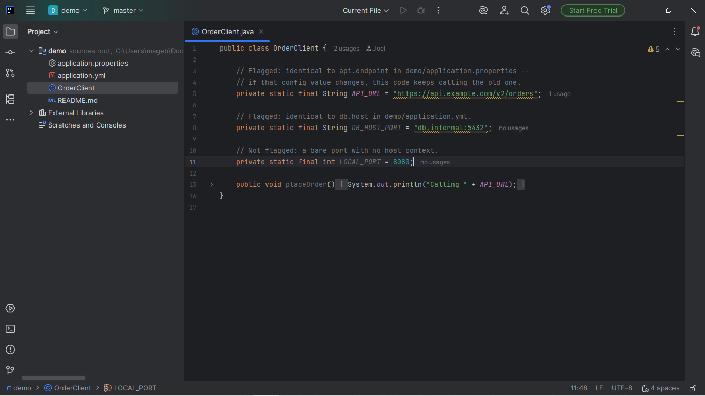
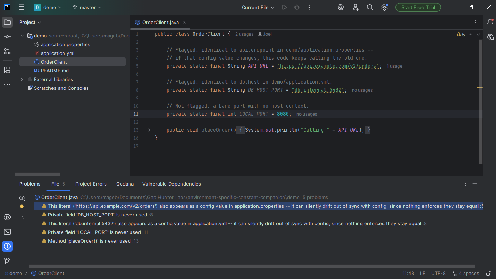

# Environment-Specific Constant Companion

IntelliJ-family plugin that flags a hardcoded URL or `host:port`
string literal in Java source that also appears, textually, as a
value in one of the project's own config files
(`.properties`/`.yml`/`.yaml`/`.env`) -- the value clearly belongs to
config, and the code copy can now silently drift out of sync with it.

## Screenshots





## Why it exists

Config drift is a real, recurring source of production incidents: a
value that gets updated one day only in the config file (the
"correct" place to change it) leaves a hardcoded copy in source code
still pointing at the old endpoint, host, or port -- with no compile
error, no test failure, and often no symptom until that specific code
path runs against production. Adjacent to this catalog's own
`config-secrets-file-companion` (which flags real secrets hardcoded in
config files) and `env-diff-companion` (which diffs keys across `.env`
files), but neither checks specifically for code-vs-config value
divergence.

## Why built this way

- **Exact string match, not fuzzy similarity.** A code literal is only
  flagged when it's textually identical to a real config value found
  elsewhere in the project -- no edit-distance heuristics, no partial
  matches. Keeps false positives near zero at the cost of missing
  near-duplicates (a trailing slash, a scheme-less variant).
- **Filename-index-backed project scan, not a raw file-tree walk.**
  Config files are located via IntelliJ's own filename index
  (`FilenameIndex.getAllFilesByExt`/`getVirtualFilesByName`), the same
  index the platform already maintains -- cheap enough to call
  directly from the inspection, no manual "refresh" action needed.
- **`host:port` shape requires a real host.** A bare port number never
  matches on its own -- and an all-digit `host` part (a coincidental
  "12:34" that reads like a time or a ratio) is rejected too, unless
  it contains a dot (so a real IP address like `10.0.0.5:5432` still
  matches).
- **Off-EDT safe, no network calls, no telemetry.**

**v0.1 scope, stated honestly:** only full URLs (`http(s)://...`) and
explicit `host:port` pairs are matched -- never a bare hostname alone
or a bare port alone. Config values are collected from `.properties`,
`.yml`, and `.yaml` files, plus the single exact filename `.env` --
`.env.*` variants (`.env.local`, `.env.production`, etc.) aren't
covered in this version.

## Usage

Install the plugin, open any Java file in a project that also has a
`.properties`/`.yml`/`.yaml`/`.env` file. If a string literal in the
Java file exactly matches a value from one of those config files, it's
highlighted with a warning naming which config file it also appears
in.

## Enterprise / Team Licensing

Need enterprise features, custom rules, or team licensing? Contact us
at **gaphunterlabs@gmail.com**.

## Development

```
./gradlew test           # unit tests
./gradlew buildPlugin    # generates build/distributions/*.zip
./gradlew verifyPlugin   # checks compatibility against real IDEs
```

## License

Apache-2.0. See `LICENSE`.
